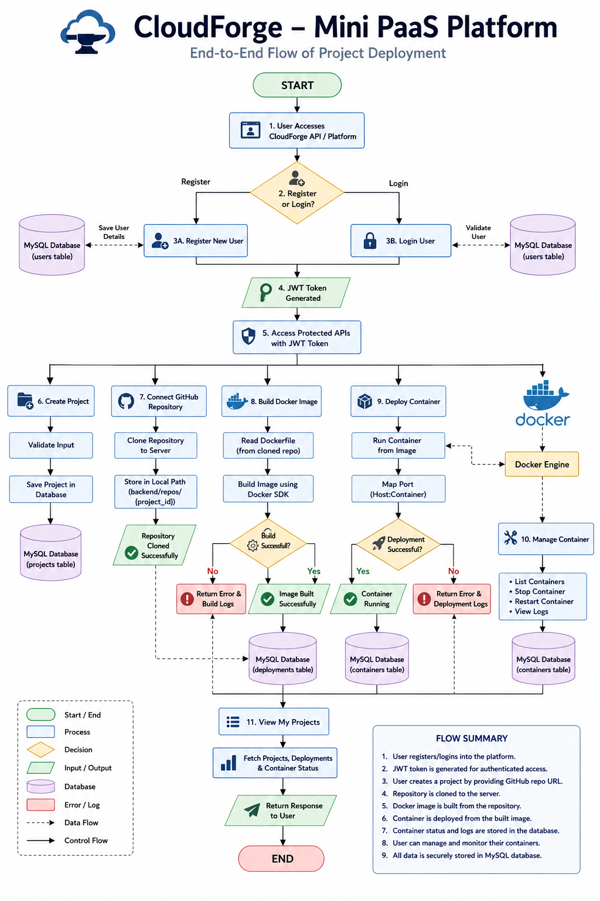

# 🚀 CloudForge

### Mini Platform as a Service (PaaS)

CloudForge is a cloud deployment platform inspired by modern DevOps tools such as Render and Railway. It automates the process of taking a GitHub repository, building a Docker image, deploying a container, and managing deployments through APIs.

---

## 📖 Overview

CloudForge simplifies application deployment by providing a backend platform where users can:

* Register and authenticate securely
* Manage multiple projects
* Connect GitHub repositories
* Build Docker images automatically
* Deploy containers with a single API call
* Track deployments and build logs
* Manage running containers

The project was built to understand the core concepts behind modern cloud deployment platforms and gain hands-on experience with DevOps workflows.

---

## 🏗️ System Architecture



---

## ✨ Features

### 🔐 Authentication & Security

* JWT Authentication
* User Registration & Login
* User-specific Authorization
* Protected APIs

### 📂 Project Management

* Create Projects
* View User Projects
* Delete Projects
* Multi-user Ownership Control

### 🔗 GitHub Integration

* GitHub Repository Support
* Automatic Repository Cloning

### 🐳 Docker Integration

* Docker Image Build Automation
* Container Deployment
* Container Listing
* Container Stop & Restart

### 📊 Deployment Monitoring

* Deployment Tracking
* Build Status Monitoring
* Build Logs Storage
* Deployment History

### 🗄️ Database Integration

* MySQL Database
* SQLAlchemy ORM
* Persistent Project Storage

---

## 🛠️ Tech Stack

| Technology   | Purpose             |
| ------------ | ------------------- |
| Python       | Backend Development |
| FastAPI      | API Framework       |
| MySQL        | Database            |
| SQLAlchemy   | ORM                 |
| Docker       | Containerization    |
| Git & GitHub | Version Control     |
| JWT          | Authentication      |

---

## ⚙️ Workflow

```text
User Login
      ↓
Create Project
      ↓
Add GitHub Repository
      ↓
Clone Repository
      ↓
Build Docker Image
      ↓
Deploy Container
      ↓
Monitor Deployment
      ↓
Running Application
```

---

## 📡 Available APIs

### Authentication

* POST /register
* POST /login
* GET /profile

### Projects

* POST /project
* GET /my-projects
* DELETE /project/{project_id}

### Build & Deploy

* POST /build
* POST /deploy
* GET /deployments
* GET /build-logs

### Containers

* GET /containers
* POST /stop-container
* POST /restart-container

---

## 🎯 Learning Outcomes

Through this project, I gained practical experience in:

* Backend API Development
* Authentication & Authorization
* Docker Containerization
* Deployment Automation
* Database Design
* Cloud Computing Concepts
* DevOps Fundamentals

---

## 🚀 Future Roadmap

* React Dashboard
* AWS EC2 Deployment
* Custom Domain Support
* Kubernetes Integration
* Monitoring & Analytics
* CI/CD Pipeline

---

## 👨‍💻 Author

**Vedant Mishra**

B.Tech Computer Science Engineering

Cloud Computing & DevOps Enthusiast

---

## ⭐ Support

If you found this project interesting, consider giving it a star on GitHub.
